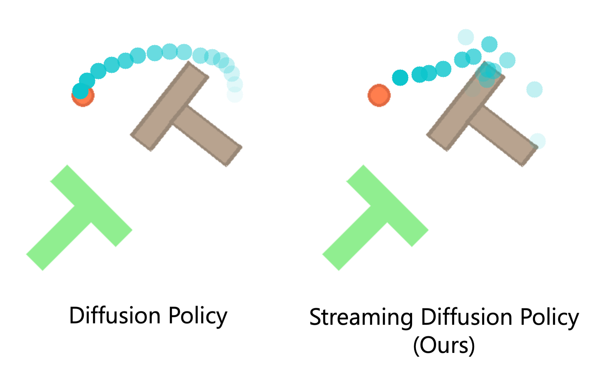

# Streaming Diffusion Policy



Official codebase for ["Streaming Diffusion Policy: Fast Policy Synthesis with Variable Noise Diffusion Models"](https://arxiv.org/abs/2406.04806). This repository is based on [Diffusion Policy](https://github.com/real-stanford/diffusion_policy). 


## Installation
See the [original Diffusion Policy repo](https://github.com/real-stanford/diffusion_policy) for installation. 

## Contributions
Our contributions to the repo are:
- The definition of state- and image-based SDP, in `diffusion_policy/policy`, in the files `tedi_unet_lowdim_policy.py` and `tedi_unet_hybrid_image_policy.py`
- The noise scheduler in `diffusion_policy/policy/schedulers.py`
- The modified model architecture in `diffusion_policy/model/diffusion/conditional_unet1d_tedi.py`

## Training
As in Diffusion Policy, we allow for training with a single seed, or multiple seeds using a Ray-cluster. 

### Single-seed training

The training uses the same command as for Diffusion Policy, only changing the .yaml file. When positioned in the root of the repo, run:
```shell
python train.py --config-dir=diffusion_policy/config/ --config-name=train_tedi_unet_lowdim_workspace.yaml
```

In the case of training the image-based policy, use the config `train_tedi_unet_hybrid_workspace.yaml` instead.

### Multi-seed training
We use the same yaml-files for the multi-seed training. On a SLURM-cluster, run:
```shell
ray start --head --num-gpus=3  --port=50004

python ray_train_multirun.py --config-dir=diffusion_policy/config --config-name=train_tedi_unet_lowdim_workspace.yaml --seeds=42,43,44
```

Se the [Diffusion Policy repo](https://github.com/real-stanford/diffusion_policy?tab=readme-ov-file#running-for-multiple-seeds) for more details. In the paper, we report   `max/test_mean_score` as "Max" and `k_min_train_loss/test_mean_score` as "Avg".


## Repoducing the results

We obtained all results in the paper by multi-seed training. The results for Consistency Policy are obtained by running multi-seed training with the [Consistency Policy repo](https://github.com/Aaditya-Prasad/Consistency-Policy/).

For the image-based Push-T task, we trained for 1000 epochs, and for image-based tasks in Robomimic we trained for 1500 epochs for Lift, Can, and Square, and 500 epochs for Transport and Tool-hang​.

## Citation

If you find our work useful, please consider citing [our paper](https://arxiv.org/abs/2406.04806):
```bibtex
@misc{høeg2024streamingdiffusionpolicyfast,
      title={Streaming Diffusion Policy: Fast Policy Synthesis with Variable Noise Diffusion Models}, 
      author={Sigmund H. Høeg and Yilun Du and Olav Egeland},
      year={2024},
      eprint={2406.04806},
      archivePrefix={arXiv},
      primaryClass={cs.RO},
      url={https://arxiv.org/abs/2406.04806}, 
}
```


## Acknowledgements

We thank the authors of [Diffusion Policy](https://github.com/real-stanford/diffusion_policy) and [Consistency Policy](https://github.com/Aaditya-Prasad/Consistency-Policy/) for sharing their codebase.
